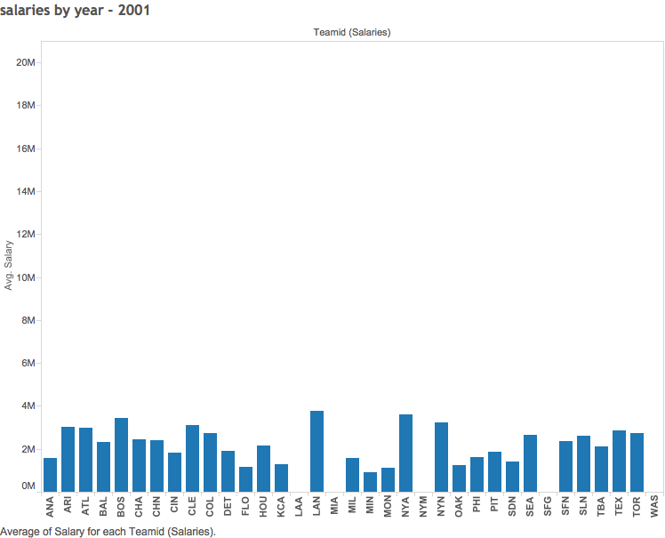

---
Batting Statistics Visualization
===

In this document, I will explain the steps taken to create a graphical visualizaiton of batting statistics from 1986-2014.

https://baseballstats.shinyapps.io/Final_Visualizations

###Boxplot of team Homeruns

Here, we wanted to visualize the difference in power hitting by team. To do so, we created a boxplot for each MLB team's homerun hitting in 2013. As you can see, teams like Arizona and Miami are not known for their power hitting. Their boxplots show little deviation and a median of 7 and 3 respectively. On the other hand, some teams have a number of power hitters. Baltimore's Nelson Cruz hit the most homeruns in the league with 53 in 2013, while the Cleveland Indians were, on average, the best power hitting team in 2013 with a team homerun median of 11.

### Texas Rangers Hitting
Texas Ranger hitting distribution for the 1989 season.

###Scatterplot of Homerun Race
One of the most historic period in baseball was the HR battles of the late 90s. In 1961, Roger Maris set the record for 61 home runs in a season. Fueled by intense competition (and a lot of steriods) three players: Barry Bonds, Mark McGwire, and Sammy Sosa alternatively set and broke the single season HR record. Culminating in 2001 with Barry Bonds hitting 73, a record which still stands today. This scatter plot charts the home runs per season by these three players

###Crosstab of Average Stats of Major Award Winners
This crosstab blends our data for award winners with batting data to determine what the average batting stats were for each award. Not surprisingly, the Cy Young award, which is given to the best pitchers each year, has the worst batting stats. This crosstab also includes a KPI we created called on base percentage. On Base Percentage is a metric used to determine how effective a batter is at not getting out. We will go into more detail on this later.

###Barchart of Team Homeruns
In one of the first visualizations we made this semester, we visualized how often teams hit homeruns. To do this we created a measure called average at bats per homerun (At bats/homeruns). The New York Yankees average the fewest at bats between homeruns. The Yankees are significantly above average in homerun frequency. The teams who hit homeruns the least frequently are the Miami Marlins, the Kansas City Royals, and the St. Louis Cardinals.

###Batting Average and OBP of Award Winners

###Declining Instances of Pitchers Pitching a Complete Game
While experimenting with pitching stats, we noticed that pitchers were throwing much fewer complete games today than in the 1980s. This visualization tests the hypothesis that pitchers were pitching less games today than in the 80s and that is why complete games have gone down. As you can see the number of games started has not changed significantly in the past 20 years. The most likely explanation for the decline in complete game frequency is a greater importance of monitoring pitch counts. In the past, when sports medicine was much less defined than it is today, pitchers were expected to pitch until they started to pitch poorly, regardless of how many pitches. Now, baseball managers have emphasized pitch count limits. Typically, once a pitcher nears the 120 pitch mark, he will be pulled no matter how well he is pitching. The belief is that a fatigued pitcher is much more likely to get injured. Therefore, this is a visualization in the rise of sports science and using metrics to keep players healthy.

###Average Pitching stats of Cy Young Award winners

###On Base Percentage of MVP Winners
We created the KPI on base percentage to visualize which players at bats are least likely to end in outs. Besides hits, on base percentage factors in walks, hit by pitch, and times hit by pitch. It is more effective than batting average because emphasizes the importance of which players are the best at getting walks. The formula we used to create this KPI is (Hits + Walks + Times Hit by Pitch) / (At bats + Walks + Times Hit by Pitch + Sacrifice Flies). The league average on base percentage is ~.320.In almost every case, the on base percentage of MVPs is significantly higher than the league average. This visualization shows that the most valuable players in the MLB are the players who are best at getting on base. The outliers in this barchart are pitchers. Pitchers practice getting people out and hardly ever practice hitting. This explains why their on base percentages are so low. 

###Crosstab of MVP Winners and Their Batting Stats

###Crosstab Ranking OBP of Texas Rangers 
This crosstab, the first we made this semester, ranks the on base percentage of every Texas Ranger since 1986 that had greater than 100 at bats.

###Relationship Between Strikeouts per Game and ERA
Again looking at pitchers, we wanted to determine how important strike outs are for succesful pitchers. Do the best pitchers get the most strikeouts, or are they able to get batters out by other means. We created a new measure called strike outs per game and filtered out pitchers who appeared in less than 10 games. What we discovered was that there is a correlation between amount of runs given up per game (era) and strike outs per game. The players with the most strike outs also let up the least amount of runs as you can tell by the trend towards the top left corner. The horizontal trend is most likely explained by reliving and closing pitchers. Some pitchers are only required to pitch for an inning or two when the starting pitcher gets tired or to close out the game. The best of those pitchers only face a few batters a game because they are able to get quick outs. Because they only pitch a couple of innings, it is not possible for them to strike out more than a couple of batters per game.

###Average Salary per Year
In the MLB there is no salary cap. Beginning in 2003, the MLB allowed teams to spend whatever they can afford on players. The only repercussion is a luxury tax. Teams that spend over a certain amount on salary have to pay an extra fee. Since this rule was implemented, the wealthiest teams have simply out bid the others to acquire the best talent. These bar charts show how average salaries have changed since this rule was implemented. Before 2003, there was relative parity in spending, but today some teams spend considerably more on players than others.

