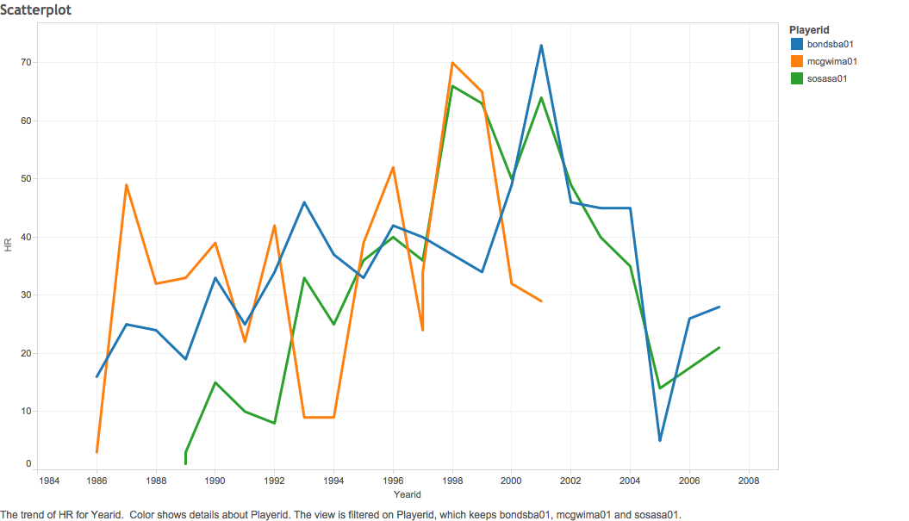
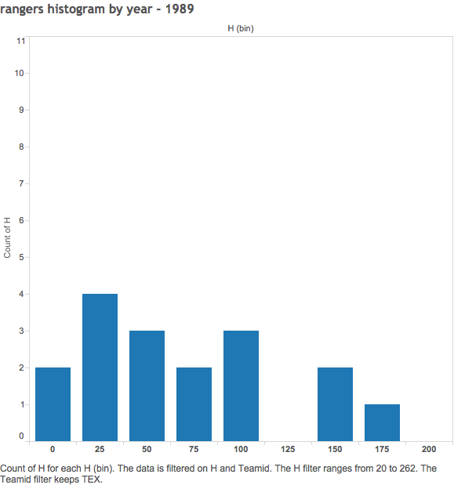

---
Batting Statistics Visualization
===

In this document, I will explain the steps taken to create a graphical visualizaiton of batting statistics from 1985-2015.

###ScatterPlot
One of the most historic period in baseball was the HR battles of the late 90s. Year after year three players: Barry Bonds, Mark McGwire, and Sammy Sosa alternatively set and broke the single season HR record. Culminating in 2001 with Barry Bonds hitting 73, a record which still stands today. This scatter plot charts the home runs per season by these three players

